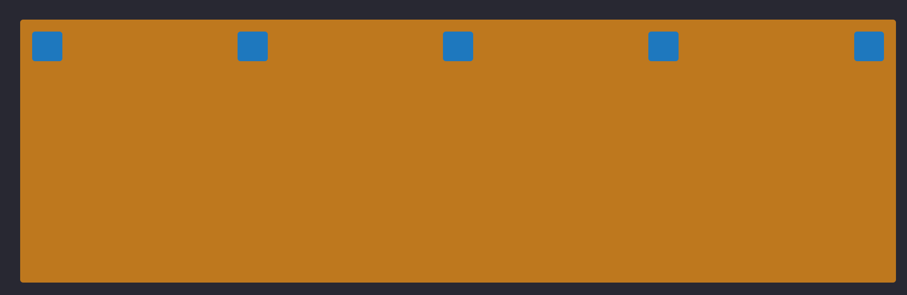
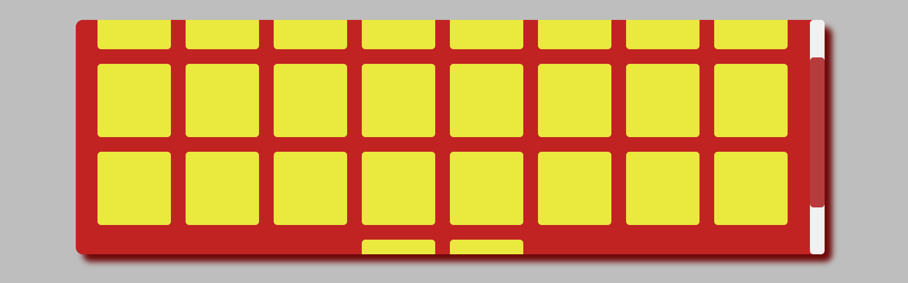
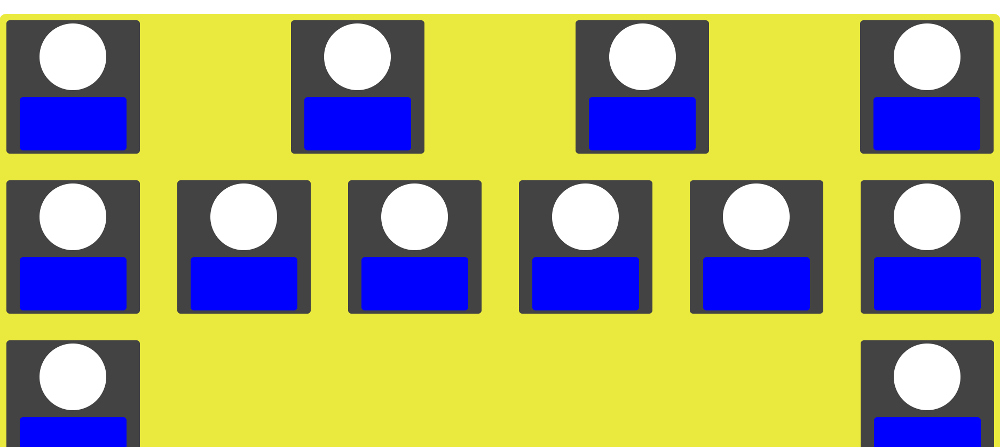
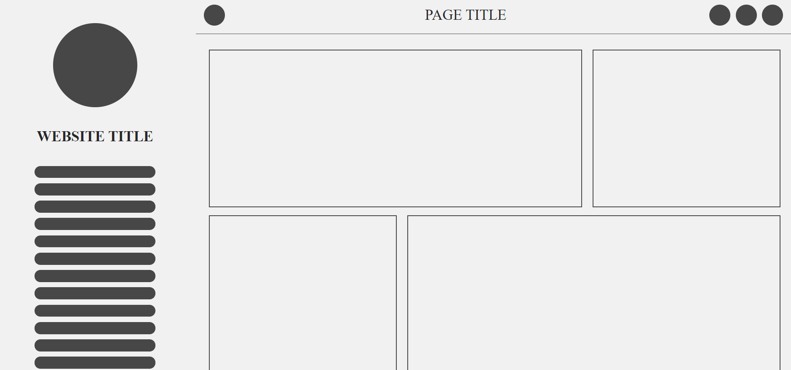
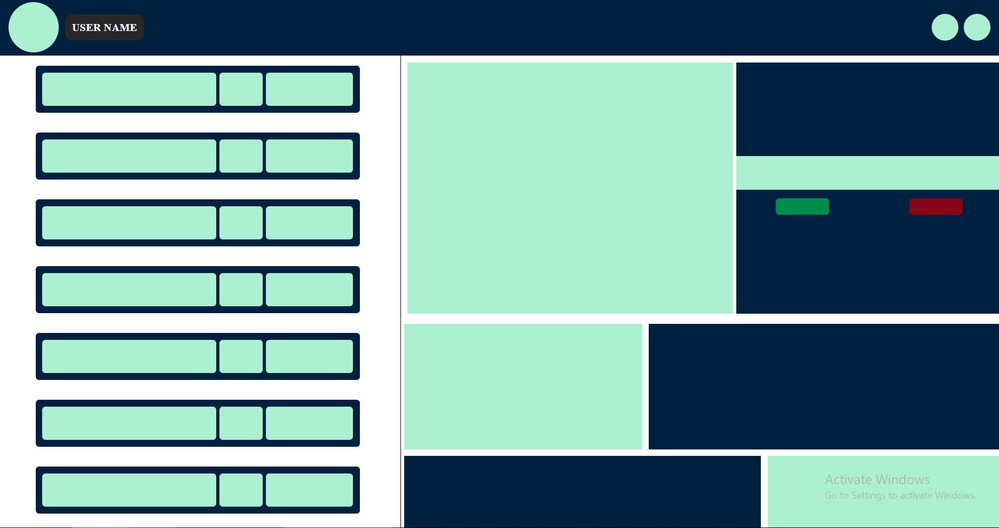

# Fix it Flex

  Creat responsive web pages with grids. Flexbox allows you to do that with just a few CSS code lines. 
  The Flexbox Layout (Flexible Box) module (a W3C Candidate Recommendation as of October 2017) aims at providing a more efficient way to lay out, align and distribute space among items      in a container, even when their size is unknown and/or dynamic (thus the word “flex”).  
  The main idea behind the flex layout is to give the container the ability to alter its items’ width/height (and order) to best fill the available space (mostly to accommodate to all kind of display devices and screen sizes). 
  A flex container expands items to fill available free space or shrinks them to prevent overflow.

### Examples

    
 Creating a simple component with items, just with justify and align:

      
    
 Give your components easy grid by just few commands:

     
    
 Create the card grid style for users:

     
    
 Simple adming panel with just flex:

     
    
 Website Shopping Card Page with flex:

     

